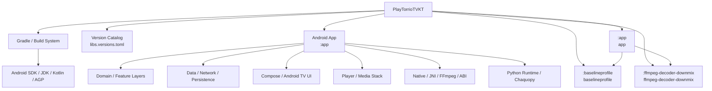
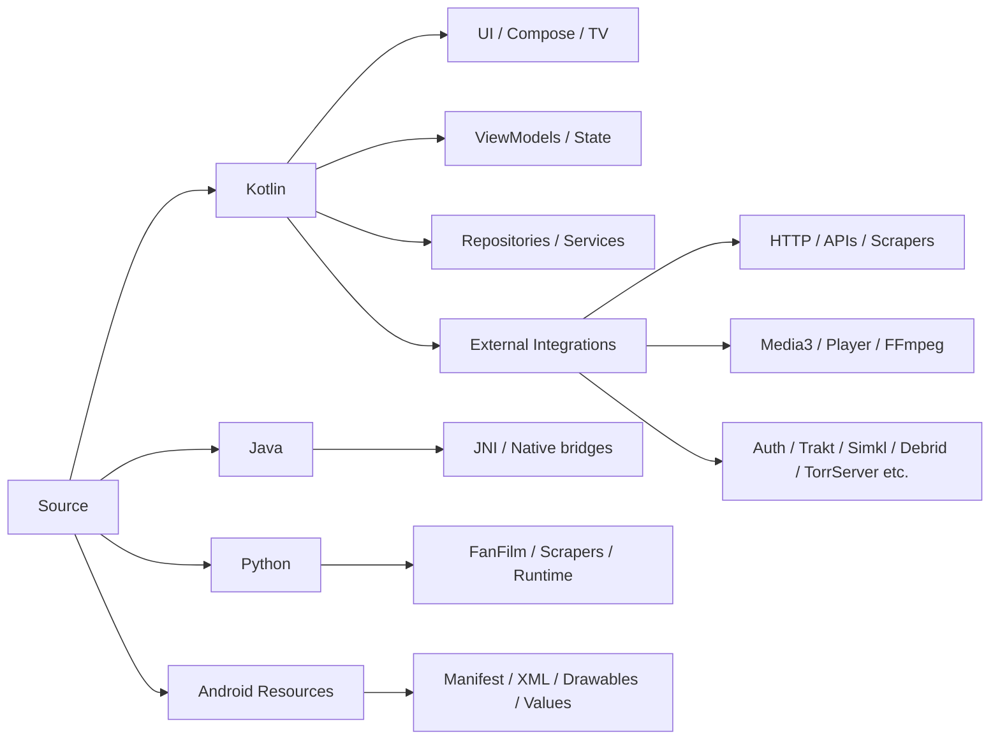
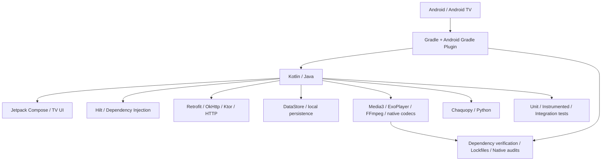

# Architektura i struktura projektu — PlayTorrioTVKT

> Dokument wygenerowany automatycznie przez skrypt audytowo-dokumentacyjny.
> Skan projektu jest READ-ONLY; skrypt nie wykonuje buildów, nie zmienia kodu i nie zmienia konfiguracji projektu.

## 1. Stan projektu

| Parametr | Wartość |
|---|---|
| Projekt | `PlayTorrioTVKT` |
| Katalog | `/home/patrrwoj89/Pulpit/fox/PlayTorrioTVKT` |
| Data generowania | `2026-09-14 11:49:46 +0200` |
| Git branch | `foxtv/enterprise-impl` |
| Git commit | `20806f2` |
| Zmienionych/niezacommitowanych wpisów Git | `1310` |
| Kotlin | `1171` plików |
| Java | `18` plików |
| Python | `972` plików |
| XML | `92` plików |
| JSON | `101` plików |

## 2. Architektura logiczna



## 3. Struktura technologiczna źródeł



## 4. Stack technologiczny

| Obszar | Wykryta technologia / informacja | Źródło |
|---|---|---|
| Projekt | FOX.TV | settings.gradle.kts |
| Język | Kotlin (1171 plików .kt) | skan projektu |
| Język | Java (18 plików .java) | skan projektu |
| Runtime | Python/Chaquopy candidate (972 plików .py) | skan projektu |
| Platforma | Android | AndroidManifest.xml |
| Framework / biblioteka | Kotlin Serialization | build.gradle(.kts) / libs.versions.toml |
| Framework / biblioteka | Navigation | build.gradle(.kts) / libs.versions.toml |
| Framework / biblioteka | Ktor | build.gradle(.kts) / libs.versions.toml |
| Framework / biblioteka | Android TV | build.gradle(.kts) / libs.versions.toml |
| Framework / biblioteka | Retrofit | build.gradle(.kts) / libs.versions.toml |
| Framework / biblioteka | Sentry | build.gradle(.kts) / libs.versions.toml |
| Framework / biblioteka | Media3 / ExoPlayer | build.gradle(.kts) / libs.versions.toml |
| Framework / biblioteka | Chaquopy | build.gradle(.kts) / libs.versions.toml |
| Framework / biblioteka | OkHttp | build.gradle(.kts) / libs.versions.toml |
| Framework / biblioteka | Coil | build.gradle(.kts) / libs.versions.toml |
| Framework / biblioteka | DataStore | build.gradle(.kts) / libs.versions.toml |
| Framework / biblioteka | Jetpack Compose | build.gradle(.kts) / libs.versions.toml |
| Framework / biblioteka | QuickJS | build.gradle(.kts) / libs.versions.toml |
| Framework / biblioteka | FFmpeg / native media | build.gradle(.kts) / libs.versions.toml |
| Framework / biblioteka | TorrServer | build.gradle(.kts) / libs.versions.toml |
| Framework / biblioteka | Hilt / Dagger | build.gradle(.kts) / libs.versions.toml |
| Framework / biblioteka | Rhino | build.gradle(.kts) / libs.versions.toml |
| Framework / biblioteka | KSP | build.gradle(.kts) / libs.versions.toml |
| Dependency management | Gradle Version Catalog (libs.versions.toml) | gradle/libs.versions.toml |
| Build system | Gradle Wrapper | gradle/wrapper/gradle-wrapper.properties |
| Gradle distribution | https//services.gradle.org/distributions/gradle-8.13-bin.zip | gradle-wrapper.properties |



## 5. Moduły Gradle

| Module ID | Katalog | Build file |
|---|---|---|
| `:root` | `.` | `build.gradle.kts` |
| `:app` | `app` | `build.gradle.kts` |
| `:baselineprofile` | `baselineprofile` | `build.gradle.kts` |
| `:ffmpeg-decoder-downmix` | `ffmpeg-decoder-downmix` | `build.gradle.kts` |

## 6. Drzewo projektu

```text
.
├── AGENTS.md
├── app
│   ├── build.gradle.kts
│   ├── .cxx
│   │   ├── Debug
│   │   │   └── 2fau1l1w
│   │   └── tools
│   │       ├── debug
│   │       └── playstoreDebug
│   ├── .gitignore
│   ├── gradle.lockfile
│   ├── libs
│   │   ├── lib-common-release.aar
│   │   ├── lib-datasource-okhttp-release.aar
│   │   ├── lib-datasource-release.aar
│   │   ├── lib-decoder-av1-release.aar
│   │   ├── lib-decoder-ffmpeg-release.aar
│   │   ├── lib-decoder-iamf-release.aar
│   │   ├── lib-decoder-mpegh-release.aar
│   │   ├── lib-exoplayer-hls-release.aar
│   │   ├── lib-exoplayer-release.aar
│   │   ├── lib-extractor-release.aar
│   │   ├── nextlib-mediainfo-local.aar
│   │   ├── quickjs-kt-android-1.0.5-playtorrio.aar
│   │   └── README.md
│   ├── proguard-rules.pro
│   └── src
│       ├── androidTest
│       │   └── java
│       ├── debug
│       │   └── res
│       ├── main
│       │   ├── AndroidManifest.xml
│       │   ├── assets
│       │   ├── cpp
│       │   ├── java
│       │   ├── jniLibs
│       │   ├── python
│       │   └── res
│       └── test
│           ├── java
│           ├── python
│           └── resources
├── architecture
├── assets
│   └── brand
│       ├── app_logo_mark.png
│       └── app_logo_wordmark.png
├── baselineprofile
│   ├── build.gradle.kts
│   ├── gradle.lockfile
│   └── src
│       └── main
│           └── java
├── build.gradle.kts
├── compose_stability_config.conf
├── CONTRIBUTING.md
├── DV7
│   └── libdovi
│       ├── android-arm64
│       │   ├── include
│       │   └── lib
│       ├── android-armeabi-v7a
│       │   ├── include
│       │   └── lib
│       ├── android-x86
│       │   ├── include
│       │   └── lib
│       └── android-x86_64
│           ├── include
│           └── lib
├── ffmpeg-decoder-downmix
│   ├── build.gradle.kts
│   ├── .cxx
│   │   ├── RelWithDebInfo
│   │   │   └── 611o4503
│   │   └── tools
│   │       └── release
│   ├── gradle.lockfile
│   ├── NOTICE.md
│   ├── README.md
│   └── src
│       └── main
│           ├── AndroidManifest.xml
│           ├── java
│           └── jni
├── FOX_TV.png
├── .gitattributes
├── .github
│   ├── ISSUE_TEMPLATE
│   │   ├── bug_report.yml
│   │   ├── config.yml
│   │   └── feature_request.yml
│   ├── PULL_REQUEST_TEMPLATE.md
│   └── workflows
│       ├── android-release.yml
│       ├── close-stale-issues.yml
│       ├── close-unlabeled-issues.yml
│       ├── pr-full-debug-build-comment.yml
│       ├── pr-full-debug-build.yml
│       ├── pr-template-check.yml
│       ├── stale-needs-info.yml
│       └── triage-needs-info.yml
├── .gitignore
├── gradle
│   ├── DETACHED_TOOLING_AUDIT.md
│   ├── detached-tooling-manifest.tsv
│   ├── libs.versions.toml
│   ├── verification-metadata.xml
│   └── wrapper
│       ├── gradle-wrapper.jar
│       └── gradle-wrapper.properties
├── gradle.properties
├── gradlew
├── gradlew.bat
├── icon.png
├── .kiro
│   ├── FOX_IMPLEMENTATION_STATE.md
│   ├── research
│   │   ├── aniyomi
│   │   │   └── f8150feba27664976e77cdb9fe021bf80ffab782
│   │   ├── dependency-modernization
│   │   │   ├── PHASE2_DECISION_MATRIX.md
│   │   │   ├── PHASE2_DEPENDENCY_AUDIT.md
│   │   │   ├── PHASE2_EXTERNAL_GATES.md
│   │   │   ├── PHASE2_FFMPEG_SOURCE_GATE.md
│   │   │   ├── PHASE2_NATIVE_AUDIT.json
│   │   │   └── PHASE2_NATIVE_AUDIT.md
│   │   └── phase3-polish-content-source-audit.md
│   └── specs
│       └── phase3-supply-chain-gate-fix
│           ├── bugfix.md
│           ├── .config.kiro
│           ├── design.md
│           ├── task-1-exploration-evidence.md
│           ├── tasks.md
│           └── tasks.meta.json
├── .kotlin
│   ├── errors
│   │   ├── errors-1789187515175.log
│   │   ├── errors-1789187515850.log
│   │   └── errors-1789261355823.log
│   └── sessions
├── LICENSE
├── local.example.properties
├── local.properties
├── org
│   └── libtorrent4j
│       └── swig
│           └── byte_vector.class
├── README.md
├── release_test_cases.csv
├── scripts
│   ├── device_runtime_check.sh
│   ├── generate_brand_assets.py
│   ├── generate_release_notes.py
│   ├── generate-release-notes.sh
│   ├── release_beta.py
│   ├── release-metadata.sh
│   ├── release_notes
│   │   ├── compose.py
│   │   ├── consolidate.py
│   │   ├── __init__.py
│   │   ├── model.py
│   │   ├── render.py
│   │   ├── rewrites.py
│   │   ├── sources.py
│   │   ├── text.py
│   │   └── vocabulary.py
│   ├── tests
│   │   ├── __init__.py
│   │   ├── test_release_channels.py
│   │   └── test_release_notes.py
│   └── vendor_fanfilm_addons.py
├── semantic-review
│   ├── 2026-09-12-175332-pr-0.md
│   ├── 2026-09-12-201430-pr-0.md
│   ├── 2026-09-12-202148-pr-0.md
│   ├── 2026-09-13-032552-pr-0.md
│   ├── 2026-09-13-055714-pr-0.md
│   ├── 2026-09-13-062428-pr-0.md
│   ├── 2026-09-13-064039-pr-0.md
│   ├── 2026-09-13-184324-pr-0.md
│   ├── 2026-09-13-184708-pr-0.md
│   └── 2026-09-13-215213-pr-3.md
├── settings.gradle.kts
├── settings-gradle.lockfile
├── tools
│   └── native
│       ├── audit_native_artifacts.py
│       ├── iamf
│       │   ├── 16kb-linker.patch
│       │   ├── LICENSE.androidx-media
│       │   ├── LICENSE.libiamf
│       │   ├── PATENTS.libiamf
│       │   ├── __pycache__
│       │   ├── README.md
│       │   ├── rebuild.sh
│       │   ├── repack_aar.py
│       │   ├── SHA256SUMS
│       │   └── verify_aar.py
│       ├── NATIVE_ARTIFACTS.lock.json
│       └── __pycache__
│           └── audit_native_artifacts.cpython-313.pyc
└── .vscode
    └── settings.json

84 directories, 123 files
```

## 7. Kluczowe pliki konfiguracyjne

- `settings.gradle.kts`
- `build.gradle.kts`
- `gradle/libs.versions.toml`
- `gradle/wrapper/gradle-wrapper.properties`
- `gradle/verification-metadata.xml`
- `gradle.properties`
- `app/build.gradle.kts`
- `app/src/main/AndroidManifest.xml`

## 8. Automatycznie wykryty stack / technologie

| Obszar | Wykryta technologia / informacja | Źródło |
|---|---|---|
| Projekt | FOX.TV | settings.gradle.kts |
| Język | Kotlin (1171 plików .kt) | skan projektu |
| Język | Java (18 plików .java) | skan projektu |
| Runtime | Python/Chaquopy candidate (972 plików .py) | skan projektu |
| Platforma | Android | AndroidManifest.xml |
| Framework / biblioteka | Kotlin Serialization | build.gradle(.kts) / libs.versions.toml |
| Framework / biblioteka | Navigation | build.gradle(.kts) / libs.versions.toml |
| Framework / biblioteka | Ktor | build.gradle(.kts) / libs.versions.toml |
| Framework / biblioteka | Android TV | build.gradle(.kts) / libs.versions.toml |
| Framework / biblioteka | Retrofit | build.gradle(.kts) / libs.versions.toml |
| Framework / biblioteka | Sentry | build.gradle(.kts) / libs.versions.toml |
| Framework / biblioteka | Media3 / ExoPlayer | build.gradle(.kts) / libs.versions.toml |
| Framework / biblioteka | Chaquopy | build.gradle(.kts) / libs.versions.toml |
| Framework / biblioteka | OkHttp | build.gradle(.kts) / libs.versions.toml |
| Framework / biblioteka | Coil | build.gradle(.kts) / libs.versions.toml |
| Framework / biblioteka | DataStore | build.gradle(.kts) / libs.versions.toml |
| Framework / biblioteka | Jetpack Compose | build.gradle(.kts) / libs.versions.toml |
| Framework / biblioteka | QuickJS | build.gradle(.kts) / libs.versions.toml |
| Framework / biblioteka | FFmpeg / native media | build.gradle(.kts) / libs.versions.toml |
| Framework / biblioteka | TorrServer | build.gradle(.kts) / libs.versions.toml |
| Framework / biblioteka | Hilt / Dagger | build.gradle(.kts) / libs.versions.toml |
| Framework / biblioteka | Rhino | build.gradle(.kts) / libs.versions.toml |
| Framework / biblioteka | KSP | build.gradle(.kts) / libs.versions.toml |
| Dependency management | Gradle Version Catalog (libs.versions.toml) | gradle/libs.versions.toml |
| Build system | Gradle Wrapper | gradle/wrapper/gradle-wrapper.properties |
| Gradle distribution | https//services.gradle.org/distributions/gradle-8.13-bin.zip | gradle-wrapper.properties |

## 9. Uwagi audytowe

- Dokument jest snapshotem stanu katalogu w momencie uruchomienia.
- Wykrywanie technologii jest heurystyczne: obecność wpisu w Gradle/katalogu nie oznacza automatycznie, że dana biblioteka jest używana w runtime.
- Relacje modułów są budowane na podstawie zależności `project(":...")` znalezionych w plikach Gradle.
- Diagramy Mermaid pozostają w repozytorium jako źródło możliwe do dalszego renderowania.
- Do pełnego potwierdzenia runtime potrzebne są osobne testy/build/device validation; ten skrypt ich nie zastępuje.

